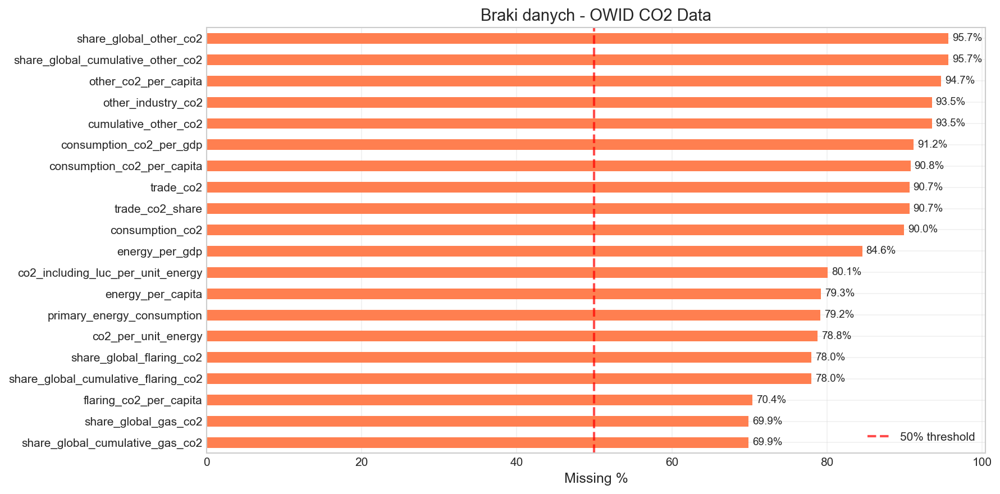
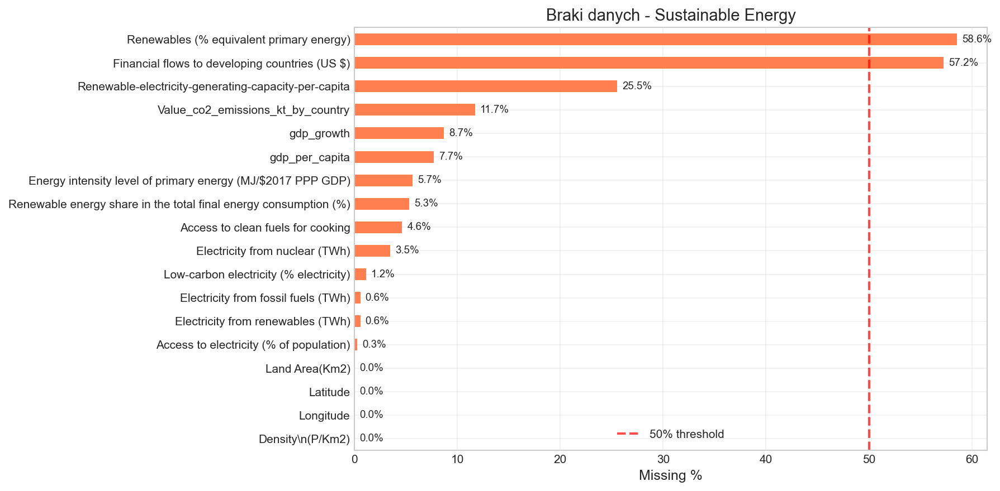
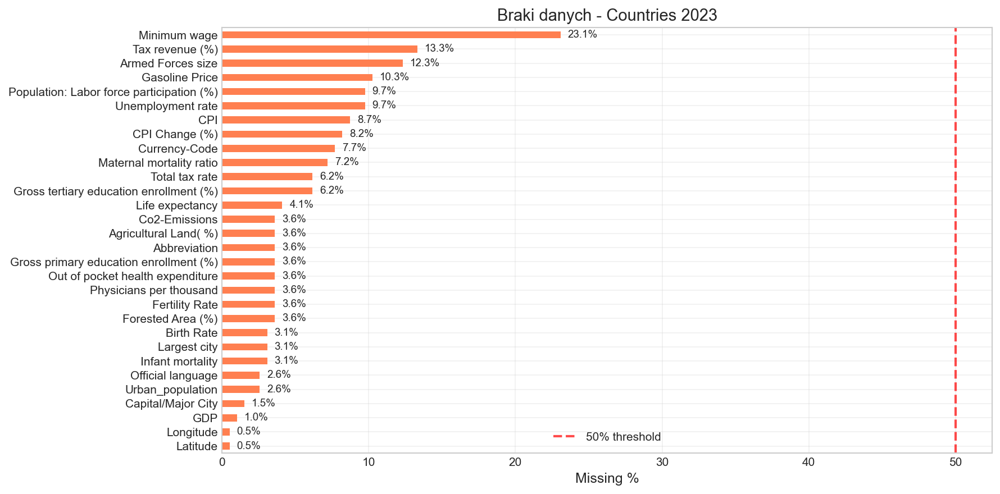

# Ocena jakości danych źródłowych

*Generated: 2026-01-18 17:29*

---

Niniejszy raport przedstawia kompleksową ocenę jakości trzech zbiorów danych wykorzystywanych w projekcie analizy wpływu rozwoju gospodarczego na emisje CO2 i transformację energetyczną.

## Ocena wiarygodności źródeł danych

Poniżej przedstawiono ocenę wiarygodności każdego z wykorzystywanych zbiorów danych. Ocena uwzględnia: pochodzenie danych, częstotliwość aktualizacji, transparentność metodologii oraz zgodność z pierwotnymi źródłami.

### Our World in Data - CO2 and Greenhouse Gas Emissions

| Metric                     | Value                            |
|:---------------------------|:---------------------------------|
| Źródło                     | Our World in Data (OWID)         |
| URL                        | https://github.com/owid/co2-data |
| Licencja                   | CC BY 4.0                        |
| Częstotliwość aktualizacji | Annual                           |
| Zakres czasowy             | 1750-2023 (most data from 1900+) |
| Pokrycie geograficzne      | ~200 countries and regions       |
| Ocena wiarygodności        | **HIGH**                         |

**Źródła pierwotne:** Global Carbon Project, Climate Watch, BP Statistical Review, CDIAC, World Bank, UN Population Division

**Uwagi:** OWID aggregates data from reputable primary sources. Data is peer-reviewed and regularly updated. Methodology is transparent and well-documented.

### Global Data on Sustainable Energy

| Metric                     | Value                                                                        |
|:---------------------------|:-----------------------------------------------------------------------------|
| Źródło                     | Kaggle (anshtanwar)                                                          |
| URL                        | https://www.kaggle.com/datasets/anshtanwar/global-data-on-sustainable-energy |
| Licencja                   | CC0 (Public Domain)                                                          |
| Częstotliwość aktualizacji | Unknown                                                                      |
| Zakres czasowy             | 2000-2020                                                                    |
| Pokrycie geograficzne      | ~170 countries                                                               |
| Ocena wiarygodności        | **MEDIUM**                                                                   |

**Źródła pierwotne:** World Bank, International Energy Agency (IEA), UN Statistics

**Uwagi:** Secondary dataset compiled from official sources. Aggregation methodology not fully documented. Data appears consistent with primary sources but requires validation.

### Countries of the World 2023

| Metric                     | Value                                                                        |
|:---------------------------|:-----------------------------------------------------------------------------|
| Źródło                     | Kaggle (nelgiriyewithana)                                                    |
| URL                        | https://www.kaggle.com/datasets/nelgiriyewithana/countries-of-the-world-2023 |
| Licencja                   | CC0 (Public Domain)                                                          |
| Częstotliwość aktualizacji | Snapshot (~2023)                                                             |
| Zakres czasowy             | Cross-sectional (~2023)                                                      |
| Pokrycie geograficzne      | ~195 countries                                                               |
| Ocena wiarygodności        | **MEDIUM**                                                                   |

**Źródła pierwotne:** World Bank, CIA World Factbook, UN Data

**Uwagi:** Cross-sectional country data from various years. Some variables may not be from 2023 exactly. Useful for supplementary analysis but not primary source.

---

## Szczegółowa ocena jakości datasetów

## Dataset: OWID CO2

### Podstawowe informacje

| Metric                  | Value     |
|:------------------------|:----------|
| Liczba wierszy          | 50,411    |
| Liczba kolumn           | 79        |
| Pamięć                  | 34.75 MB  |
| Całkowita liczba braków | 2,105,679 |
| Procent braków          | 52.87%    |

### Rozkład typów danych

| Typ     |   Liczba |
|:--------|---------:|
| float64 |       76 |
| object  |        2 |
| int64   |        1 |

### Pokrycie czasowe

| Metric         |   Value |
|:---------------|--------:|
| Minimalny rok  |    1750 |
| Maksymalny rok |    2024 |
| Zakres lat     |     274 |
| Unikalne lata  |     275 |

### Pokrycie geograficzne

| Metric                    | Value   |
|:--------------------------|:--------|
| Kolumna identyfikująca    | country |
| Unikalne kraje            | 221     |
| Całkowita liczba rekordów | 50,411  |
| Łącznie z agregatami      | 254     |

#### Top 10 krajów (wg liczby rekordów)

| Kraj               |   Liczba rekordów |
|:-------------------|------------------:|
| Afghanistan        |               275 |
| Andorra            |               275 |
| Australia          |               275 |
| Bangladesh         |               275 |
| Bahrain            |               275 |
| Bhutan             |               275 |
| Barbados           |               275 |
| Bolivia            |               275 |
| Dominican Republic |               275 |
| Cote d'Ivoire      |               275 |

### Pokrycie zmiennych (kompletność danych)

**Podsumowanie kompletności zmiennych:**

- Excellent (≥95%): 2 zmienne

- Good (80-95%): 5 zmiennych

- Moderate (50-80%): 27 zmiennych

- Poor (20-50%): 33 zmienne

- Very Poor (<20%): 12 zmiennych

> ⚠️ **Warning:** Znaleziono 45 zmiennych z pokryciem <50%. Te zmienne mogą wymagać szczególnej uwagi podczas analizy.

#### Zmienne z niskim pokryciem (<50%)

| column                              | dtype   |   coverage_pct |   null_count |
|:------------------------------------|:--------|---------------:|-------------:|
| share_global_other_co2              | float64 |           4.3  |        48241 |
| share_global_cumulative_other_co2   | float64 |           4.3  |        48241 |
| other_co2_per_capita                | float64 |           5.27 |        47752 |
| cumulative_other_co2                | float64 |           6.45 |        47157 |
| other_industry_co2                  | float64 |           6.45 |        47157 |
| consumption_co2_per_gdp             | float64 |           8.82 |        45963 |
| consumption_co2_per_capita          | float64 |           9.21 |        45768 |
| trade_co2                           | float64 |           9.35 |        45699 |
| trade_co2_share                     | float64 |           9.35 |        45699 |
| consumption_co2                     | float64 |          10.02 |        45358 |
| energy_per_gdp                      | float64 |          15.45 |        42624 |
| co2_including_luc_per_unit_energy   | float64 |          19.88 |        40391 |
| energy_per_capita                   | float64 |          20.75 |        39952 |
| primary_energy_consumption          | float64 |          20.83 |        39908 |
| co2_per_unit_energy                 | float64 |          21.22 |        39712 |
| share_global_cumulative_flaring_co2 | float64 |          22    |        39322 |
| share_global_flaring_co2            | float64 |          22    |        39322 |
| flaring_co2_per_capita              | float64 |          29.58 |        35501 |
| share_global_gas_co2                | float64 |          30.09 |        35244 |
| share_global_cumulative_gas_co2     | float64 |          30.09 |        35244 |

*Figure 1: Braki danych według zmiennych - OWID CO2*

### Ocena kluczowych zmiennych (OWID CO2)

| Zmienna                    | Pokrycie %   |   Unikalne | Min      | Mediana          | Max        |
|:---------------------------|:-------------|-----------:|:---------|:-----------------|:-----------|
| country                    | 100.0%       |        254 | (tekst)  | Top: Afghanistan | (tekst)    |
| year                       | 100.0%       |        275 | 1,750.00 | 1,925.00         | 2,024.00   |
| iso_code                   | 84.3%        |        218 | (tekst)  | Top: AFG         | (tekst)    |
| population                 | 81.7%        |      40197 | 215.00   | 2.29e+06         | 8.16e+09   |
| gdp                        | 30.3%        |      15249 | 5.00e+07 | 2.74e+10         | 1.30e+14   |
| co2                        | 58.3%        |      16509 | 0.0000   | 5.08             | 38,598.58  |
| co2_per_capita             | 52.6%        |       8871 | 0.0000   | 1.02             | 782.74     |
| co2_per_gdp                | 34.8%        |       1721 | 0.0000   | 0.2640           | 82.60      |
| primary_energy_consumption | 20.8%        |       9567 | 0.0000   | 59.67            | 176,737.09 |
| energy_per_capita          | 20.7%        |      10372 | 0.0000   | 11,883.90        | 318,559.69 |

---

## Dataset: Sustainable Energy

### Podstawowe informacje

| Metric                  | Value   |
|:------------------------|:--------|
| Liczba wierszy          | 3,649   |
| Liczba kolumn           | 21      |
| Pamięć                  | 0.91 MB |
| Całkowita liczba braków | 6,978   |
| Procent braków          | 9.11%   |

### Rozkład typów danych

| Typ     |   Liczba |
|:--------|---------:|
| float64 |       18 |
| object  |        2 |
| int64   |        1 |

### Pokrycie czasowe

| Metric         | Value   |
|:---------------|:--------|
| Minimalny rok  | 2000    |
| Maksymalny rok | 2020    |
| Zakres lat     | 20      |
| Unikalne lata  | 21      |
| Kolumna roku   | Year    |

### Pokrycie geograficzne

| Metric                    | Value   |
|:--------------------------|:--------|
| Kolumna identyfikująca    | Entity  |
| Unikalne kraje            | 176     |
| Całkowita liczba rekordów | 3,649   |

#### Top 10 krajów (wg liczby rekordów)

| Kraj                |   Liczba rekordów |
|:--------------------|------------------:|
| Afghanistan         |                21 |
| Albania             |                21 |
| Algeria             |                21 |
| Angola              |                21 |
| Antigua and Barbuda |                21 |
| Argentina           |                21 |
| Armenia             |                21 |
| Aruba               |                21 |
| Australia           |                21 |
| Austria             |                21 |

### Pokrycie zmiennych (kompletność danych)

**Podsumowanie kompletności zmiennych:**

- Excellent (≥95%): 13 zmiennych

- Good (80-95%): 5 zmiennych

- Moderate (50-80%): 1 zmienna

- Poor (20-50%): 2 zmienne

> ⚠️ **Warning:** Znaleziono 2 zmienne z pokryciem <50%. Te zmienne mogą wymagać szczególnej uwagi podczas analizy.

#### Zmienne z niskim pokryciem (<50%)

| column                                         | dtype   |   coverage_pct |   null_count |
|:-----------------------------------------------|:--------|---------------:|-------------:|
| Renewables (% equivalent primary energy)       | float64 |          41.44 |         2137 |
| Financial flows to developing countries (US $) | float64 |          42.75 |         2089 |

*Figure 2: Braki danych według zmiennych - Sustainable Energy*

### Ocena kluczowych zmiennych (Sustainable Energy)

| Zmienna                                                          | Pokrycie %   |   Unikalne | Min      | Mediana          | Max        |
|:-----------------------------------------------------------------|:-------------|-----------:|:---------|:-----------------|:-----------|
| Entity                                                           | 100.0%       |        176 | (tekst)  | Top: Afghanistan | (tekst)    |
| Year                                                             | 100.0%       |         21 | 2,000.00 | 2,010.00         | 2,020.00   |
| Access to electricity (% of population)                          | 99.7%        |       2040 | 1.25     | 98.36            | 100.00     |
| Renewable energy share in the total final energy consumption (%) | 94.7%        |       2587 | 0.0000   | 23.30            | 96.04      |
| Electricity from renewables (TWh)                                | 99.4%        |       1533 | 0.0000   | 1.47             | 2,184.94   |
| gdp_per_capita                                                   | 92.3%        |       3367 | 111.93   | 4,578.63         | 123,514.20 |
| gdp_growth                                                       | 91.3%        |       3320 | -62.08   | 3.56             | 123.14     |
| Energy intensity level of primary energy (MJ/$2017 PPP GDP)      | 94.3%        |       1044 | 0.1100   | 4.30             | 32.57      |

---

## Dataset: Countries 2023

### Podstawowe informacje

| Metric                  | Value   |
|:------------------------|:--------|
| Liczba wierszy          | 195     |
| Liczba kolumn           | 35      |
| Pamięć                  | 0.27 MB |
| Całkowita liczba braków | 341     |
| Procent braków          | 5.00%   |

### Rozkład typów danych

| Typ     |   Liczba |
|:--------|---------:|
| object  |       26 |
| float64 |        9 |

### Pokrycie geograficzne

| Metric                    | Value   |
|:--------------------------|:--------|
| Kolumna identyfikująca    | Country |
| Unikalne kraje            | 195     |
| Całkowita liczba rekordów | 195     |

#### Top 10 krajów (wg liczby rekordów)

| Kraj                |   Liczba rekordów |
|:--------------------|------------------:|
| Afghanistan         |                 1 |
| Albania             |                 1 |
| Algeria             |                 1 |
| Andorra             |                 1 |
| Angola              |                 1 |
| Antigua and Barbuda |                 1 |
| Argentina           |                 1 |
| Armenia             |                 1 |
| Australia           |                 1 |
| Austria             |                 1 |

### Pokrycie zmiennych (kompletność danych)

**Podsumowanie kompletności zmiennych:**

- Excellent (≥95%): 23 zmienne

- Good (80-95%): 11 zmiennych

- Moderate (50-80%): 1 zmienna

*Figure 3: Braki danych według zmiennych - Countries 2023*

### Ocena kluczowych zmiennych (Countries 2023)

> ⚠️ **Warning:** Brak następujących zmiennych: CO2 Emissions

| Zmienna                | Pokrycie %   |   Unikalne | Min      | Mediana          | Max       |
|:-----------------------|:-------------|-----------:|:---------|:-----------------|:----------|
| Country                | 100.0%       |        195 | (tekst)  | Top: Afghanistan | (tekst)   |
| Population *           | 99.5%        |        194 | 836.00   | 8.83e+06         | 1.40e+09  |
| GDP *                  | 99.0%        |        193 | 4.73e+07 | 3.44e+10         | 2.14e+13  |
| Urban_population *     | 97.4%        |        190 | 5,464.00 | 4.68e+06         | 8.43e+08  |
| Agricultural Land(%) * | 96.4%        |        168 | 0.6000   | 39.60            | 82.60     |
| Unemployment rate *    | 90.3%        |        164 | 0.0900   | 5.36             | 28.18     |
| Density *              | 100.0%       |        137 | 2.00     | 89.00            | 26,337.00 |

*\* Wartości skonwertowane z formatu tekstowego*

---

## Ocena przydatności danych i możliwości uogólnienia

### Przydatność do celów badawczych

Zebrane dane pozwalają na analizę związku między rozwojem gospodarczym (mierzonym PKB per capita) a emisjami CO2 oraz transformacją energetyczną. Kluczowe pytania badawcze możliwe do zbadania:

- Weryfikacja hipotezy krzywej środowiskowej Kuznetsa (EKC)

- Analiza czynników wpływających na emisje CO2 per capita

- Badanie tempa transformacji energetycznej w różnych krajach

- Porównania regionalne i grupowe

### Ograniczenia i zastrzeżenia

- **Agregaty regionalne**: Dane OWID zawierają agregaty (World, Europe, etc.) które należy wykluczyć z analizy na poziomie krajów

- **Braki danych historycznych**: Dane przed 1960 r. są niekompletne dla wielu krajów

- **Różne definicje**: Nazwy krajów mogą się różnić między datasetami (np. 'USA' vs 'United States')

- **Dane przekrojowe vs panelowe**: Dataset 'Countries 2023' jest przekrojowy i może nie być w pełni kompatybilny z danymi panelowymi

- **Typy danych**: Niektóre kolumny numeryczne są zapisane jako tekst (np. z separatorami tysięcy) i wymagają konwersji

### Możliwości uogólnienia wyników

Dane obejmują większość krajów świata (>150 krajów) i okres 2000-2020, co pozwala na:

- Wnioskowanie globalne o trendach emisji i transformacji energetycznej

- Porównania między grupami krajów (rozwinięte vs rozwijające się)

- Analizę trendów czasowych

**Ograniczenia uogólnienia:** Wyniki mogą nie być w pełni reprezentatywne dla małych państw wyspiarskich i terytoriów zależnych ze względu na braki danych.

---

## Podsumowanie i rekomendacje

### Główne wnioski

- **OWID CO2** - wysokiej jakości, dobrze udokumentowany zbiór danych, odpowiedni jako główne źródło do analizy emisji

- **Sustainable Energy** - uzupełniający zbiór z danymi o OZE, wymaga walidacji z pierwotnymi źródłami

- **Countries 2023** - przydatny do analizy przekrojowej, ale ograniczony dla analizy panelowej; wymaga konwersji typów danych

### Rekomendowane kroki czyszczenia

1. Standaryzacja nazw krajów między datasetami

2. Usunięcie agregatów regionalnych z OWID

3. Wybór wspólnego zakresu czasowego (2000-2020)

4. Konwersja kolumn tekstowych na numeryczne (Countries 2023)

5. Identyfikacja i obsługa zmiennych z niskim pokryciem

6. Walidacja zgodności danych między źródłami

*Szczegółowe statystyki pokrycia zapisano do: `../out/quality/coverage_stats.csv`*
