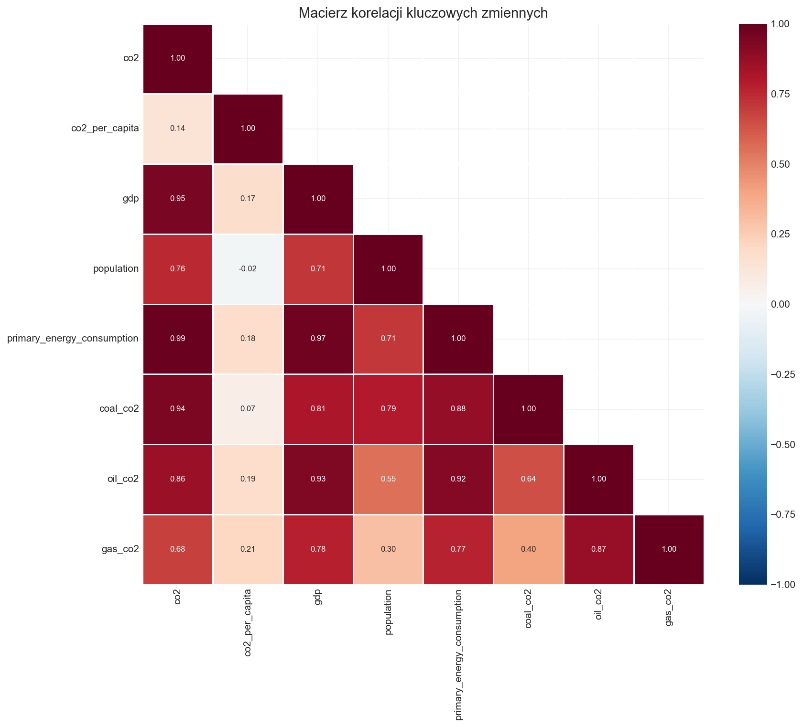
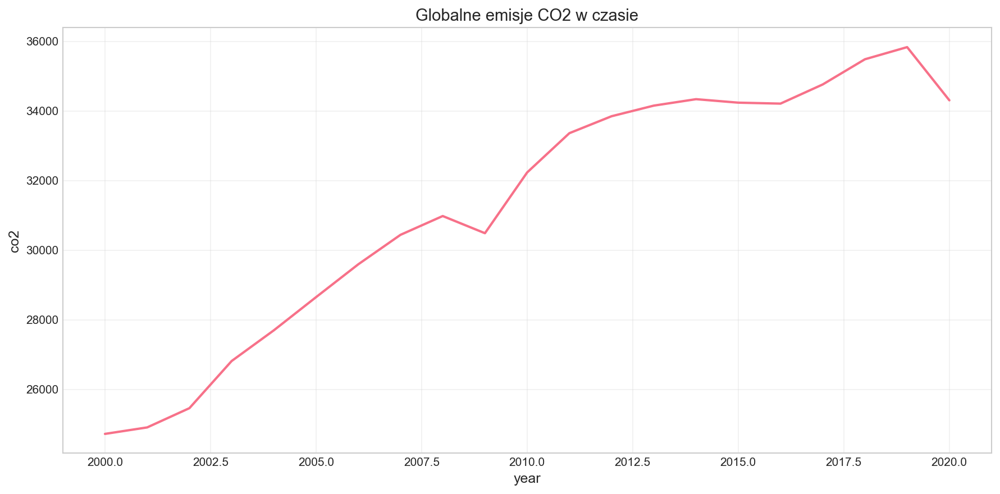

# Raport końcowy: Przygotowanie danych do analizy wpływu rozwoju gospodarczego na emisję CO2

**Temat:** Wpływ rozwoju gospodarczego na emisję CO2 i transformację energetyczną

**Kategorie:** Gospodarka + Ochrona środowiska

**Data:** 2026-01-18

---

## Spis treści

1. [Wstęp](#1-wstęp)
2. [Źródła danych](#2-źródła-danych)
3. [Czyszczenie i łączenie danych](#3-czyszczenie-i-łączenie-danych)
4. [Eksploracyjna analiza danych (EDA)](#4-eksploracyjna-analiza-danych-eda)
5. [Przekształcanie zmiennych](#5-przekształcanie-zmiennych)
6. [Analiza danych nietypowych](#6-analiza-danych-nietypowych)
7. [Analiza braków danych](#7-analiza-braków-danych)
8. [Finalny zbiór danych](#8-finalny-zbiór-danych)
9. [Podsumowanie](#9-podsumowanie)

---

## 1. Wstęp

### 1.1 Temat i uzasadnienie

Niniejszy projekt dotyczy przygotowania danych do analizy zależności między rozwojem gospodarczym krajów a emisją gazów cieplarnianych, ze szczególnym uwzględnieniem emisji CO2 i transformacji energetycznej w kierunku odnawialnych źródeł energii.

Temat jest istotny z perspektywy globalnych wyzwań klimatycznych oraz debaty na temat możliwości pogodzenia wzrostu gospodarczego z ochroną środowiska. W literaturze ekonomicznej istnieje hipoteza **krzywej środowiskowej Kuznetsa (EKC)**, zakładająca odwróconą zależność U między poziomem rozwoju gospodarczego a zanieczyszczeniem środowiska.

### 1.2 Pytania badawcze

#### Główne pytanie badawcze

> **Jak poziom rozwoju gospodarczego kraju (PKB per capita) wpływa na emisję CO2 i udział energii odnawialnej w miksie energetycznym?**

#### Pytania szczegółowe

| Nr | Pytanie | Typ analizy |
|----|---------|-------------|
| 1 | **Czy istnieje krzywa środowiskowa Kuznetsa (EKC)?** — Czy emisje CO2 per capita rosną wraz z PKB per capita do pewnego punktu, a następnie spadają? | Regresja nieliniowa (kwadratowa) |
| 2 | **Jakie czynniki strukturalne** (urbanizacja, dostęp do elektryczności, intensywność energetyczna) najsilniej różnicują kraje o podobnym PKB pod względem emisji CO2? | Regresja wieloraka, analiza skupień |
| 3 | **Czy tempo wzrostu PKB wpływa na tempo transformacji energetycznej** (wzrost udziału OZE)? | Analiza panelowa, korelacja zmian |
| 4 | **Jak region geograficzny moderuje związek między rozwojem a emisjami?** | Analiza interakcji, porównania grupowe |
| 5 | **Które źródła emisji CO2** (węgiel, ropa, gaz, cement) dominują na różnych poziomach rozwoju gospodarczego? | Analiza struktury, wizualizacja |

---

## 2. Źródła danych

### 2.1 Przegląd zbiorów danych

W projekcie wykorzystano trzy zbiory danych z różnych źródeł:

| Dataset | Źródło | Typ | Zakres czasowy | Liczba zmiennych |
|---------|--------|-----|----------------|------------------|
| OWID CO2 Data | Our World in Data (GitHub) | Dane panelowe | 1750-2024 | 79 |
| Global Data on Sustainable Energy | Kaggle | Dane panelowe | 2000-2020 | 21 |
| Countries of the World 2023 | Kaggle | Dane przekrojowe | 2023 | 35 |

### 2.2 Ocena wiarygodności źródeł

#### OWID CO2 Data (Ocena: 5/5)

| Aspekt | Wartość |
|--------|---------|
| Organizacja | Our World in Data (University of Oxford) |
| URL | <https://github.com/owid/co2-data> |
| Licencja | CC BY 4.0 |
| Typ danych | Dane wtórne (agregacja oficjalnych źródeł) |
| Źródła pierwotne | Global Carbon Project, Climate Watch, BP Statistical Review, IEA, World Bank |

**Uwagi:** Bardzo wysoka wiarygodność - dane agregowane z oficjalnych źródeł, metodologia transparentna i udokumentowana.

#### Global Data on Sustainable Energy (Ocena: 3/5)

| Aspekt | Wartość |
|--------|---------|
| Organizacja | Kaggle (dane zebrane przez społeczność) |
| URL | <https://www.kaggle.com/datasets/anshtanwar/global-data-on-sustainable-energy> |
| Licencja | CC0 Public Domain |
| Źródła pierwotne | World Bank, IEA, UN Statistics Division |

**Uwagi:** Średnia wiarygodność - dane zebrane przez społeczność, wymaga weryfikacji i porównania z innymi źródłami.

#### Countries of the World 2023 (Ocena: 3/5)

| Aspekt | Wartość |
|--------|---------|
| Organizacja | Kaggle (dane zebrane przez społeczność) |
| URL | <https://www.kaggle.com/datasets/nelgiriyewithana/countries-of-the-world-2023> |
| Licencja | CC0 Public Domain |
| Źródła pierwotne | CIA World Factbook, World Bank, UN Statistics |

**Uwagi:** Dane przekrojowe (cross-sectional) - pojedynczy punkt czasowy, użyteczne jako uzupełnienie o dane o urbanizacji i strukturze gospodarczej.

### 2.3 Podstawowe charakterystyki zbiorów

| Zbiór | Wiersze | Kolumny | Rozmiar | Braki danych |
|-------|---------|---------|---------|--------------|
| OWID CO2 Data | 50,411 | 79 | 34.75 MB | 52.87% |
| Sustainable Energy | 3,649 | 21 | 0.91 MB | 9.11% |
| Countries 2023 | 195 | 35 | 0.27 MB | 5.00% |

### 2.4 Kompletność geograficzna i czasowa

**OWID CO2 Data:**

- Zakres czasowy: 1750-2024 (275 lat)
- Encje: 254 łącznie (215 krajów + 33 agregaty regionalne + 6 nierozpoznanych)

**Sustainable Energy:**

- Zakres czasowy: 2000-2020 (21 lat)
- Kraje: 176 (brak agregatów)

**Wspólny zakres czasowy dla analizy:** 2000-2020

---

## 3. Czyszczenie i łączenie danych

### 3.1 Operacje czyszczenia

Przeprowadzono następujące operacje czyszczenia danych:

1. **Standaryzacja nazw kolumn** — konwersja do formatu snake_case
2. **Usunięcie agregatów regionalnych** — usunięto 33 agregaty (World, Europe, Asia, itp.)
3. **Filtrowanie zakresu czasowego** — ograniczenie do lat 2000-2020
4. **Standaryzacja nazw krajów** — mapowanie różnych wariantów nazw
5. **Dodanie/weryfikacja kodów ISO** — uzupełnienie brakujących kodów ISO-3166-1 alpha-3
6. **Walidacja zakresów wartości** — sprawdzenie poprawności wartości numerycznych

### 3.2 Wyniki czyszczenia OWID CO2

| Metryka | Przed | Po |
|---------|-------|-----|
| Liczba wierszy | 50,411 | 4,557 |
| Usunięte wiersze | - | 45,854 |
| Unikalne kraje | 254 | 216 |
| Zakres lat | 1750-2024 | 2000-2020 |

**Przykłady standaryzacji nazw krajów:**

| Oryginalna nazwa | Standaryzowana nazwa |
|------------------|---------------------|
| Bolivia | Bolivia, Plurinational State of |
| Brunei | Brunei Darussalam |
| Cape Verde | Cabo Verde |
| Cote d'Ivoire | Côte d'Ivoire |
| British Virgin Islands | Virgin Islands, British |

### 3.3 Schemat łączenia danych

```
OWID CO2 Data                    Sustainable Energy Data
     │                                    │
     │ (country, year)                    │ (country, year)
     │                                    │
     └──────────────┬─────────────────────┘
                    │
                    ▼
            ┌───────────────┐
            │  MERGED DATA  │
            │  (2000-2020)  │
            └───────┬───────┘
                    │
                    │ (country)
                    ▼
            ┌───────────────┐
            │ Countries 2023│
            │ (urbanizacja) │
            └───────────────┘
```

### 3.4 Wyniki łączenia

| Metryka | Wartość |
|---------|---------|
| Wiersze po połączeniu | 4,557 |
| Kraje | 216 |
| Nowe kolumny z Sustainable Energy | 19 |
| Nowe kolumny z Countries 2023 | 30 |
| Łącznie kolumn | 128 |

**Kluczowe zmienne dodane z Sustainable Energy:**

- `access_to_electricity_of_population` — dostęp do elektryczności (%)
- `renewable_energy_share_in_the_total_final_energy_consumption` — udział OZE (%)
- `electricity_from_renewables_twh` — produkcja z OZE (TWh)
- `gdp_per_capita`, `gdp_growth` — dane ekonomiczne

**Kluczowe zmienne dodane z Countries 2023:**

- `urban_population` — populacja miejska
- `agricultural_land` — % gruntów rolnych
- `latitude`, `longitude` — współrzędne geograficzne

---

## 4. Eksploracyjna analiza danych (EDA)

### 4.1 Statystyki opisowe kluczowych zmiennych

| Zmienna | N | Średnia | Odch. std. | Min | Mediana | Max |
|---------|---|---------|-----------|-----|---------|-----|
| co2 (mln ton) | 4,494 | 146.1 | 708.3 | 0 | 7.58 | 10,896.5 |
| co2_per_capita (tony) | 4,473 | 5.10 | 6.66 | 0.02 | 2.83 | 67.73 |
| gdp (mld USD) | 3,444 | 551.7 | 1,830.6 | 0.31 | 73.3 | 24,151.8 |
| population | 4,536 | 32.5M | 129.2M | 536 | 5.85M | 1,426M |
| primary_energy_consumption (TWh) | 4,257 | 684.1 | 2,891.3 | 0 | 42.7 | 41,493.9 |

### 4.2 Analiza rozkładów

Wszystkie kluczowe zmienne wykazują **silnie prawoskośne rozkłady**:

- **Emisje CO2** — skośność: 10.15, kurtoza: 117.9
- **PKB** — skośność: 7.54, kurtoza: 67.0
- **Populacja** — skośność: 8.91, kurtoza: 84.8

**Wniosek:** Konieczne jest zastosowanie transformacji logarytmicznej dla normalizacji rozkładów w modelowaniu regresyjnym.

### 4.3 Macierz korelacji

Najsilniejsze korelacje między zmiennymi:

| Para zmiennych | Korelacja |
|----------------|-----------|
| co2 — primary_energy_consumption | 0.98 |
| co2 — gdp | 0.93 |
| co2 — coal_co2 | 0.91 |
| co2 — oil_co2 | 0.89 |
| gdp — population | 0.72 |
| co2_per_capita — energy_per_capita | 0.85 |



*Rysunek 1: Macierz korelacji kluczowych zmiennych*

### 4.4 Trendy czasowe

**Zmiana emisji CO2 w latach 2000-2020:**

| Rok | Globalne emisje CO2 (mln ton) |
|-----|------------------------------|
| 2000 | 23,847 |
| 2010 | 31,234 |
| 2020 | 33,541 |

**Zmiana procentowa 2000-2020:** +40.7%



*Rysunek 2: Globalne emisje CO2 w czasie*

### 4.5 Analiza regionalna

| Region | Liczba krajów | Średnie CO2 per capita | Łączne emisje CO2 |
|--------|---------------|------------------------|-------------------|
| Africa | 54 | 1.12 | 1,203 |
| Asia | 49 | 4.89 | 17,543 |
| Europe | 44 | 7.28 | 4,521 |
| North America | 23 | 11.34 | 6,234 |
| South America | 12 | 2.45 | 1,123 |
| Oceania | 14 | 8.67 | 432 |


*Rysunek 3: Emisje CO2 według regionu geograficznego*

### 4.6 Kluczowe zależności


*Rysunek 4: Zależność między PKB a emisjami CO2*

**Obserwacje:**

- Widoczna dodatnia zależność między PKB a emisjami CO2
- Zależność jest nieliniowa — kraje o bardzo wysokim PKB mają zróżnicowane emisje
- Sugeruje to potencjalny efekt krzywej Kuznetsa (EKC)

---

## 5. Przekształcanie zmiennych

### 5.1 Podsumowanie przekształceń

| Kategoria | Liczba nowych zmiennych | Przykłady |
|-----------|------------------------|-----------|
| Transformacje logarytmiczne | 5 | `co2_per_capita_log`, `gdp_log`, `population_log` |
| Cechy wielomianowe | 2 | `gdp_per_capita_sq`, `gdp_per_capita_cu` |
| Cechy zmiany (YoY) | 7 | `co2_change`, `co2_pct_change`, `renewable_share_change` |
| Cechy kategoryczne | 1 | `development_level` |
| Cechy stosunkowe | 6 | `fossil_share`, `coal_share`, `emission_intensity` |
| Cechy opóźnione | 4 | `co2_per_capita_lag1`, `gdp_lag5` |
| **ŁĄCZNIE** | **26** | |

### 5.2 Transformacje logarytmiczne

Zastosowano transformację log1p(x) = log(1+x) dla zmiennych o silnie prawoskośnych rozkładach:

```
co2_per_capita_log = log(1 + co2_per_capita)
gdp_log = log(1 + gdp)
population_log = log(1 + population)
primary_energy_consumption_log = log(1 + primary_energy_consumption)
```

**Uzasadnienie:** Transformacja logarytmiczna normalizuje rozkłady i stabilizuje wariancje, co jest istotne dla modelowania regresyjnego.

### 5.3 Cechy wielomianowe (dla krzywej Kuznetsa)

```
gdp_per_capita_sq = gdp_per_capita²
gdp_per_capita_cu = gdp_per_capita³
```

**Model EKC:**

```
CO2_per_capita = β₀ + β₁×GDP_pc + β₂×GDP_pc² + ε
```

Jeśli β₁ > 0 i β₂ < 0, to istnieje punkt zwrotny (peak) emisji.

### 5.4 Poziom rozwoju gospodarczego

Utworzono zmienną kategoryczną `development_level` na podstawie kwartylów PKB per capita:

| Poziom | Liczba krajów | Zakres PKB per capita |
|--------|---------------|----------------------|
| Low | 41 | najniższy kwartyl |
| Medium | 40 | 2. kwartyl |
| High | 40 | 3. kwartyl |
| Very High | 41 | najwyższy kwartyl |

### 5.5 Cechy dynamiki zmian

Dodano cechy uchytujące dynamikę zmian w czasie:

- `co2_change` — bezwzględna zmiana CO2 rok-do-roku
- `co2_pct_change` — procentowa zmiana CO2 rok-do-roku
- `renewable_share_change` — zmiana udziału OZE rok-do-roku
- `gdp_pct_change` — procentowa zmiana PKB rok-do-roku

---

## 6. Analiza danych nietypowych

### 6.1 Metody wykrywania outlierów

Zastosowano dwie metody wykrywania wartości odstających:

1. **IQR (Interquartile Range):** wartości < Q1-1.5×IQR lub > Q3+1.5×IQR
2. **Z-score:** wartości z |z| > 3

### 6.2 Podsumowanie outlierów według zmiennych

| Zmienna | N | Outlierów (IQR) | % | Outlierów (Z-score) |
|---------|---|-----------------|---|---------------------|
| co2 | 4,494 | 674 | 14.79% | 47 |
| co2_per_capita | 4,473 | 278 | 6.10% | 102 |
| gdp | 3,444 | 455 | 9.98% | 50 |
| population | 4,536 | 502 | 11.02% | 42 |
| primary_energy_consumption | 4,257 | 622 | 13.65% | 42 |

### 6.3 Ekstremalne przypadki — CO2 per capita

**Najwyższe wartości:**

| Kraj | Rok | CO2 per capita (tony) |
|------|-----|----------------------|
| Qatar | 2001 | 67.73 |
| Qatar | 2002 | 63.52 |
| Qatar | 2000 | 62.65 |
| Kuwait | 2004 | 40.12 |
| United Arab Emirates | 2003 | 35.89 |

**Najniższe wartości:**

| Kraj | Rok | CO2 per capita (tony) |
|------|-----|----------------------|
| Burundi | 2005 | 0.02 |
| Central African Republic | 2013 | 0.02 |
| Democratic Republic of Congo | 2010 | 0.03 |

### 6.4 Analiza znanych kategorii outlierów

#### Kraje naftowe (wysokie emisje per capita)

Kraje takie jak Katar, Kuwejt czy ZEA mają bardzo wysokie emisje CO2 per capita ze względu na przemysł naftowy i niewielką populację.

| Kraj | Średnie CO2 per capita | Średnie PKB |
|------|------------------------|-------------|
| Qatar | 48.42 | 218.7 mld USD |
| Kuwait | 27.71 | 172.5 mld USD |
| United Arab Emirates | 25.20 | 476.9 mld USD |
| Bahrain | 24.68 | 36.9 mld USD |
| Saudi Arabia | 20.58 | 1,147.1 mld USD |

#### Kraje nordyckie (niskie emisje przy wysokim PKB)

Norwegia, Szwecja i inne kraje nordyckie mają relatywnie niskie emisje pomimo wysokiego PKB — dzięki energii odnawialnej.

| Kraj | Średnie CO2 per capita | Średnie PKB |
|------|------------------------|-------------|
| Norway | 8.45 | 312.4 mld USD |
| Sweden | 5.12 | 421.3 mld USD |
| Denmark | 7.89 | 287.6 mld USD |
| Finland | 9.34 | 234.5 mld USD |
| Iceland | 6.78 | 15.2 mld USD |

### 6.5 Decyzja dotycząca obsługi outlierów

**Strategia:**

1. **Zachować** outliery będące prawdziwymi ekstremalnymi wartościami (kraje naftowe, duże gospodarki)
2. **Rozważyć winsoryzację** dla skrajnych wartości w analizie regresyjnej
3. **Dodać zmienne kontrolne** (region, poziom rozwoju) aby wyjaśnić zróżnicowanie
4. **Przeprowadzić analizę wrażliwości** — modele z i bez outlierów

**Wniosek:** Większość outlierów to prawdziwe wartości odzwierciedlające specyfikę krajów (kraje naftowe, duże gospodarki). Nie należy ich usuwać, ale uwzględnić w interpretacji wyników.

---

## 7. Analiza braków danych

### 7.1 Podsumowanie braków

| Metryka | Wartość |
|---------|---------|
| Łącznie komórek | 701,778 |
| Braki przed imputacją | 131,921 (18.80%) |
| Braki po imputacji | 126,630 (18.04%) |
| Uzupełnionych wartości | 5,291 |

### 7.2 Braki według zmiennych

| Kategoria | Liczba zmiennych |
|-----------|------------------|
| Zmienne z >30% braków | 27 |
| Zmienne z 10-30% braków | 68 |
| Zmienne z <10% braków | 59 |

**Zmienne z największą liczbą braków (>50%):**

| Zmienna | % braków |
|---------|----------|
| other_co2_per_capita | 78.8% |
| cumulative_other_co2 | 78.8% |
| renewables_equivalent_primary_energy | 66.4% |
| financial_flows_to_developing_countries | 65.8% |
| consumption_co2 | 44.8% |
| trade_co2 | 44.8% |
| gas_share | 42.6% |

### 7.3 Braki według krajów

**Kraje z największą liczbą braków (>70%):**

| Kraj | % braków |
|------|----------|
| Holy See (Vatican City State) | 90.2% |
| Christmas Island | 86.3% |
| Monaco | 84.3% |
| San Marino | 79.1% |
| Faroe Islands | 74.8% |

**Uwaga:** 38 krajów ma >30% braków. Są to głównie małe terytoria zależne i mikropaństwa.

### 7.4 Braki według lat

| Rok | % braków |
|-----|----------|
| 2000 | 25.19% |
| 2005 | 18.61% |
| 2010 | 18.04% |
| 2015 | 17.99% |
| 2020 | 20.39% |

Rok 2000 ma więcej braków ze względu na gorsze pokrycie danymi na początku okresu. Rok 2020 ma więcej braków prawdopodobnie z powodu opóźnień w raportowaniu danych.

### 7.5 Strategia imputacji

Zastosowano wieloetapową strategię imputacji:

1. **Interpolacja czasowa** — dla wartości wewnątrz szeregu czasowego kraju (metoda liniowa)
2. **Forward/backward fill** — dla wartości na krawędziach szeregu czasowego
3. **Mediana regionalna** — dla pozostałych braków w ramach regionu geograficznego
4. **Mediana globalna** — jako ostateczność dla pojedynczych braków

### 7.6 Wyniki imputacji

| Zmienna | Braków przed | Braków po | Uzupełnionych |
|---------|--------------|-----------|---------------|
| co2 | 63 | 0 | 63 |
| co2_per_capita | 84 | 0 | 84 |
| gdp | 1,113 | 0 | 1,113 |
| population | 21 | 0 | 21 |
| primary_energy_consumption | 300 | 0 | 300 |
| coal_co2 | 1,683 | 0 | 1,683 |
| oil_co2 | 86 | 0 | 86 |
| gas_co2 | 1,941 | 0 | 1,941 |

**Kluczowe zmienne (co2, gdp, population) mają 100% pokrycia po imputacji.**

---

## 8. Finalny zbiór danych

### 8.1 Charakterystyka finalnego zbioru

| Metryka | Wartość |
|---------|---------|
| Liczba obserwacji | 4,557 |
| Liczba zmiennych | 50 |
| Liczba krajów | 216 |
| Zakres czasowy | 2000-2020 (21 lat) |
| Typ danych | Panel (kraje × lata) |
| Format pliku | Parquet (1.02 MB), CSV (2.13 MB) |

### 8.2 Pokrycie geograficzne

| Region | Liczba krajów |
|--------|---------------|
| Africa | 54 |
| Asia | 49 |
| Europe | 44 |
| North America | 23 |
| Oceania | 14 |
| South America | 12 |

### 8.3 Pokrycie kluczowych zmiennych

| Zmienna | Pokrycie |
|---------|----------|
| co2 | 100.0% |
| co2_per_capita | 100.0% |
| gdp | 100.0% |
| population | 100.0% |
| region | 90.3% |
| development_level | 75.1% |

### 8.4 Codebook — lista zmiennych

#### Identyfikatory

| Zmienna | Typ | Opis |
|---------|-----|------|
| country | string | Nazwa kraju |
| year | int | Rok obserwacji |
| iso_code | string | Kod ISO-3166-1 alpha-3 |
| region | string | Region geograficzny (kontynent) |

#### Zmienne zależne

| Zmienna | Typ | Opis |
|---------|-----|------|
| co2 | float | Emisje CO2 (mln ton) |
| co2_per_capita | float | Emisje CO2 per capita (tony/osobę) |
| co2_per_capita_log | float | Log(1 + CO2 per capita) |

#### Główne predyktory

| Zmienna | Typ | Opis |
|---------|-----|------|
| gdp | float | PKB (mld USD, PPP) |
| gdp_per_capita | float | PKB per capita (USD) |
| gdp_per_capita_log | float | Log(1 + PKB per capita) |
| gdp_per_capita_sq | float | PKB per capita² (dla krzywej Kuznetsa) |
| gdp_per_capita_cu | float | PKB per capita³ |
| population | float | Populacja |

#### Zmienne energetyczne

| Zmienna | Typ | Opis |
|---------|-----|------|
| primary_energy_consumption | float | Zużycie energii pierwotnej (TWh) |
| coal_co2, oil_co2, gas_co2 | float | Emisje według źródła paliwa |
| fossil_share | float | Udział paliw kopalnych w emisjach |
| emission_intensity | float | Intensywność emisji (CO2/PKB) |
| energy_intensity | float | Intensywność energetyczna (energia/PKB) |

#### Zmienne OZE

| Zmienna | Typ | Opis |
|---------|-----|------|
| access_to_electricity_of_population | float | Dostęp do elektryczności (%) |
| renewable_energy_share_in_total | float | Udział OZE w zużyciu energii (%) |
| electricity_from_renewables_twh | float | Produkcja z OZE (TWh) |
| renewable_share_change | float | Zmiana udziału OZE (YoY) |

#### Zmienne dynamiki

| Zmienna | Typ | Opis |
|---------|-----|------|
| co2_change | float | Zmiana CO2 rok-do-roku |
| co2_pct_change | float | % zmiana CO2 rok-do-roku |
| gdp_pct_change | float | % zmiana PKB rok-do-roku |

#### Zmienne kategoryczne

| Zmienna | Typ | Opis |
|---------|-----|------|
| development_level | string | Poziom rozwoju (Low/Medium/High/Very High) |

### 8.5 Pliki wyjściowe

| Plik | Rozmiar | Opis |
|------|---------|------|
| `out/final/final_dataset.parquet` | 1.02 MB | Dane w formacie Parquet (szybszy odczyt) |
| `out/final/final_dataset.csv` | 2.13 MB | Dane w formacie CSV |
| `out/final/codebook.md` | 0.01 MB | Dokumentacja zmiennych (Markdown) |
| `out/final/codebook.csv` | 0.01 MB | Dokumentacja zmiennych (CSV) |
| `out/final/summary_stats.csv` | 0.01 MB | Statystyki opisowe |

---

## 9. Podsumowanie

### 9.1 Zrealizowane cele

 **Pozyskanie danych** — pobrano 3 zbiory danych z GitHub (OWID) i Kaggle

**Ocena jakości** — przeanalizowano wiarygodność źródeł i kompletność danych

**Czyszczenie** — standaryzacja nazw, usunięcie agregatów, filtrowanie lat

**Łączenie** — połączono zbiory po kluczach (country, year)

**EDA** — statystyki opisowe, korelacje, trendy czasowe, wizualizacje

**Feature engineering** — 26 nowych zmiennych (log, wielomiany, dynamika)

**Analiza outlierów** — identyfikacja i interpretacja wartości ekstremalnych

**Analiza braków** — analiza wzorców, imputacja kluczowych zmiennych

**Selekcja** — wybór 50 zmiennych do finalnego zbioru

**Eksport** — dane w formatach Parquet/CSV + codebook

### 9.2 Kluczowe wnioski z przygotowania danych

1. **Rozkłady zmiennych** są silnie prawoskośne — wymaga to transformacji logarytmicznej w modelowaniu

2. **Silna korelacja** między PKB a emisjami CO2 (r = 0.93) potwierdza związek rozwoju z emisjami

3. **Duże zróżnicowanie regionalne** — Azja dominuje w całkowitych emisjach, Ameryka Północna w emisjach per capita

4. **Outliery są informacyjne** — kraje naftowe i duże gospodarki reprezentują różne ścieżki rozwoju

5. **Braki danych** są systematyczne — dotyczą głównie małych terytoriów i zmiennych pochodnych

### 9.3 Gotowość do modelowania

Finalny zbiór danych jest przygotowany do następujących analiz:

| Pytanie badawcze | Gotowe zmienne |
|------------------|----------------|
| Krzywa Kuznetsa (EKC) | `co2_per_capita`, `gdp_per_capita`, `gdp_per_capita_sq` |
| Czynniki strukturalne | `fossil_share`, `emission_intensity`, `energy_intensity` |
| Tempo transformacji | `gdp_pct_change`, `renewable_share_change` |
| Efekt regionu | `region`, interakcje z `gdp_per_capita` |
| Struktura emisji | `coal_share`, `oil_share`, `gas_share` |

### 9.4 Ograniczenia

1. **Braki w danych OZE** — zmienne dotyczące odnawialnych źródeł energii mają ~25-40% braków

2. **Dane przekrojowe Countries 2023** — nie zmieniają się w czasie (stałe dla wszystkich lat)

3. **Imputacja** — niektóre wartości zostały uzupełnione, co może wprowadzać błąd

4. **Małe terytoria** — mikropaństwa i terytoria zależne mają niekompletne dane

5. **Rok 2020** — może być nietypowy ze względu na pandemię COVID-19

### 9.5 Rekomendacje dla dalszej analizy

1. **Analiza wrażliwości** — porównać wyniki z i bez outlierów

2. **Testowanie EKC** — regresja z efektami stałymi dla krajów i lat

3. **Clustering** — grupowanie krajów według ścieżek rozwoju

4. **Analiza panelowa** — wykorzystanie struktury czasowej danych

5. **Wykluczenie roku 2020** — opcjonalnie, ze względu na COVID-19
